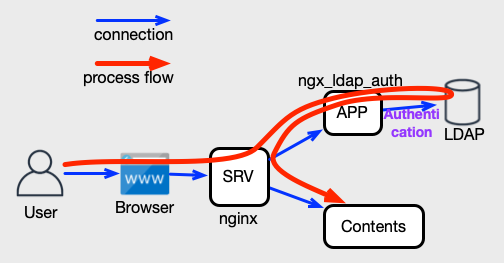
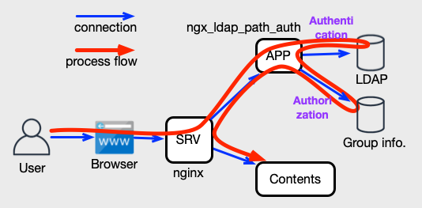
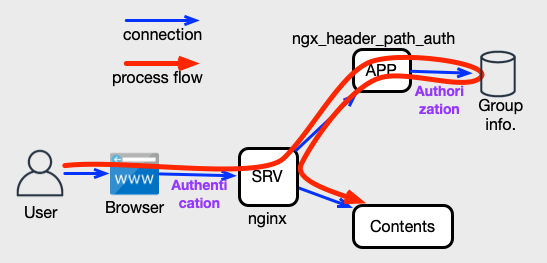
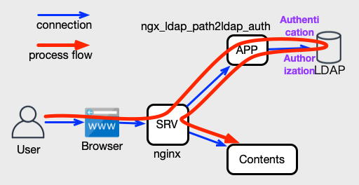
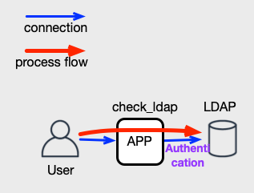
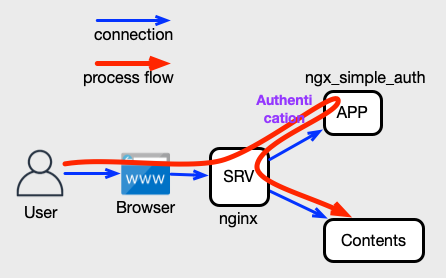

Japanese documents is [here](../docs_ja/README.md).

# ngx\_auth\_mod

**ngx\_auth\_mod** is a set of modules that provides authentication processing for [nginx auth request module](http://nginx.org/en/docs/http/ngx_http_auth_request_module.html).

## Getting started

See the [Getting Started document](GettingStarted.md).

## Module specifications

### ngx\_ldap\_auth 

**ngx\_ldap\_auth** is a module that authenticates entities using the LDAP bind operation.

The LDAP authentication process provided by **ngx\_ldap\_auth** is shown in the diagram below.

Read [more ngx\_ldap\_auth specification](ngx_ldap_auth.md).

### ngx\_ldap\_path\_auth 

**ngx\_ldap\_path\_auth** is a module that authenticates entities using the LDAP bind operation, and authorizes based on the file path.

The LDAP authentication process and authorization process using the group information provided by **ngx\_ldap\_path\_auth** is shown in the diagram below.

Read [more ngx\_ldap\_path\_auth specification](ngx_ldap_path_auth.md).

### ngx\_header\_path\_auth 

**ngx\_header\_path\_auth** is a module that uses the username and filepath passed in the HTTP headers for authorization processing.

The authorization process using the group information provided by **ngx\_header\_path\_auth** is shown in the diagram below.

Read [more ngx\_header\_path\_auth specification](ngx_header_path_auth.md).

### ngx\_ldap\_path2ldap\_auth 

**ngx\_ldap\_path2ldap\_auth** is a module that authenticates entities using the LDAP bind operation, and authorizes by file path and LDAP information.

The LDAP authentication process and authorization process using the LDAP information provided by **ngx\_ldap\_path2ldap\_auth** is shown in the diagram below.

Read [more ngx\_ldap\_path2ldap\_auth specification](ngx_ldap_path2ldap_auth.md).

### check\_ldap

**check\_ldap** is a command to check the operation of LDAP authentication process using the **ngx\_ldap\_auth** or **ngx\_ldap\_path\_auth** configuration file.

Read [more check\_ldap specification](check_ldap.md).

### ngx\_simple\_auth

**ngx\_simple\_auth** is a module that authenticates with the account information in the configuration file.

**ngx\_simple\_auth** authenticates without external data, so it can be used to check [nginx auth request module](http://nginx.org/en/docs/http/ngx_http_auth_request_module.html) configuration.

Read [more ngx\_simple\_auth specification](ngx_simple_auth.md).
