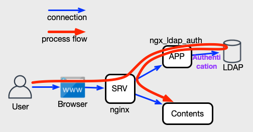
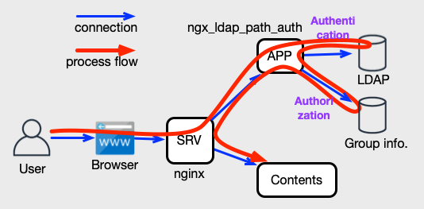
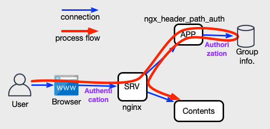
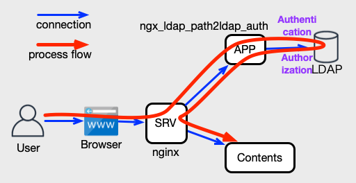
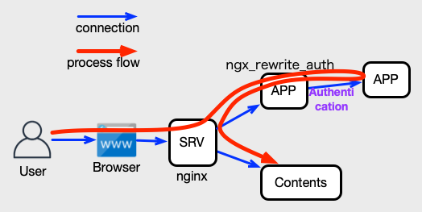
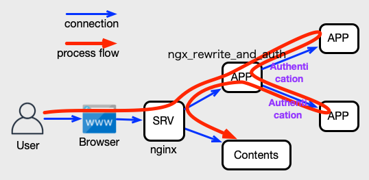
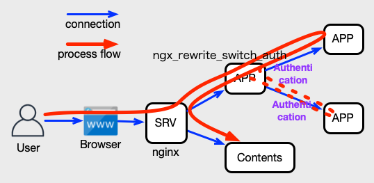
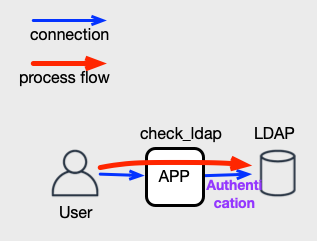
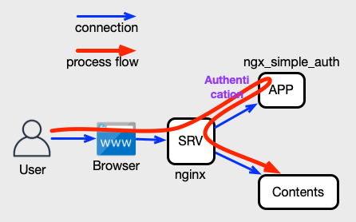

[auth request module]: http://nginx.org/en/docs/http/ngx_http_auth_request_module.html

Japanese documents is [here](../docs_ja/README.md).

# ngx\_auth\_mod

**ngx\_auth\_mod** is a set of modules that provides authentication processing for nginx [auth request module].

## Getting started

See the [Getting Started document](GettingStarted.md).

## Module specifications

### ngx\_ldap\_auth 

**ngx\_ldap\_auth** is a module that authenticates entities using the LDAP bind operation.

The LDAP authentication process provided by **ngx\_ldap\_auth** is shown in the diagram below.

Read [more ngx\_ldap\_auth specification](ngx_ldap_auth.md).

### ngx\_ldap\_path\_auth 

**ngx\_ldap\_path\_auth** is a module that authenticates entities using the LDAP bind operation, and authorizes based on the file path.

The LDAP authentication process and authorization process using the group information provided by **ngx\_ldap\_path\_auth** is shown in the diagram below.

Read [more ngx\_ldap\_path\_auth specification](ngx_ldap_path_auth.md).

### ngx\_header\_path\_auth 

**ngx\_header\_path\_auth** is a module that uses the username and filepath passed in the HTTP headers for authorization processing.

The authorization process using the group information provided by **ngx\_header\_path\_auth** is shown in the diagram below.

Read [more ngx\_header\_path\_auth specification](ngx_header_path_auth.md).

### ngx\_ldap\_path2ldap\_auth 

**ngx\_ldap\_path2ldap\_auth** is a module that authenticates entities using the LDAP bind operation, and authorizes by file path and LDAP information.

The LDAP authentication process and authorization process using the LDAP information provided by **ngx\_ldap\_path2ldap\_auth** is shown in the diagram below.

Read [more ngx\_ldap\_path2ldap\_auth specification](ngx_ldap_path2ldap_auth.md).

### ngx\_rewrite\_auth 

**ngx\_rewrite\_auth** is an authentication module that calls for another authentication on the rewritten request.
This module can also convert from Basic authentication to authentication for nginx [auth request module].   
Only when the called authentication is successful will this authentication be successful.

**ngx\_rewrite\_auth** calls an external authentication module as shown in the following diagram.

This module is flexible and can be used in a variety of ways, including:

- **Reusing authentication from another site**.
    - Basic authentication on another site can be converted to authentication for the nginx [auth request module].
- **Authentication proxy**.
    - Authentication for nginx [auth request module] on another server can be used.
- **Authentication by email address**.
    - Email addresses can be converted to usernames. (ex. `user@example.com` -> `user`)
- **Username restrictions**.
    - Usernames that are authenticated by regular expressions can be filtered.
- **Customize cache settings**.
    - The header for cache can be overridden.

Read [more ngx\_rewrite\_auth specification](ngx_rewrite_auth.md).

### ngx\_rewrite\_and\_auth 

**ngx\_rewrite\_and\_auth** is an authentication module that calls for multiple authentications with rewritten requests.
This module can also convert from Basic authentication to authentication for nginx [auth request module].   
Only when all the called authentications are successful will this authentication be successful.

**ngx\_rewrite\_and\_auth** calls an external authentication module as shown in the following diagram.

This module is flexible and can be used in a variety of ways, including:

- **Authentication and authorization separation**.
    - The systems can be separated according to usage.
    - For example, **ngx\_ldap\_auth** and **ngx\_header\_auth** can be combined.
- **Replacement of the authorization part**.
    - Authorization process can be reused.
- **Multiple authorizations combining**.
    - Authentications to be combined can be selected.

Read [more ngx\_rewrite\_and\_auth specification](ngx_rewrite_and_auth.md).

### ngx\_rewrite\_switch\_auth 

**ngx\_rewrite\_switch\_auth** is an authentication module that calls the chosen authentication based on a username pattern.
This module can also convert from Basic authentication to authentication for nginx [auth request module].   
Only if the authentication chosen for the username pattern is successful will this authentication be successful.

**ngx\_rewrite\_switch\_auth** calls an external authentication module as shown in the following diagram.

This module is flexible and can be used in a variety of ways, including:

- **Authentication of multiple organizations**.
    - Authentication process can be switched by email domain.
- **Multi-form authentication**.
    - Both email addresses and usernames can be authenticated.

Read [more ngx\_rewrite\_switch\_auth specification](ngx_rewrite_switch_auth.md).

### check\_ldap

**check\_ldap** is a command to check the operation of LDAP authentication process using the **ngx\_ldap\_auth** or **ngx\_ldap\_path\_auth** configuration file.

Read [more check\_ldap specification](check_ldap.md).

### ngx\_simple\_auth

**ngx\_simple\_auth** is a module that authenticates with the account information in the configuration file.

**ngx\_simple\_auth** authenticates without external data, so it can be used to check nginx [auth request module](http://nginx.org/en/docs/http/ngx_http_auth_request_module.html) configuration.

Read [more ngx\_simple\_auth specification](ngx_simple_auth.md).
