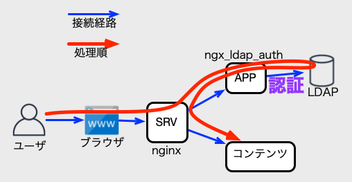
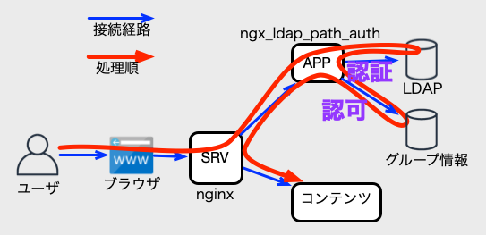
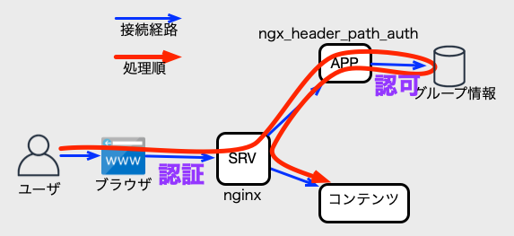
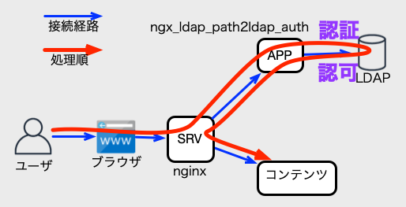
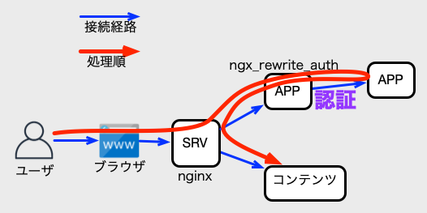
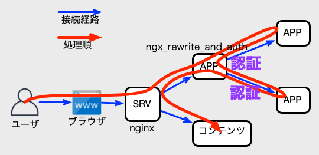
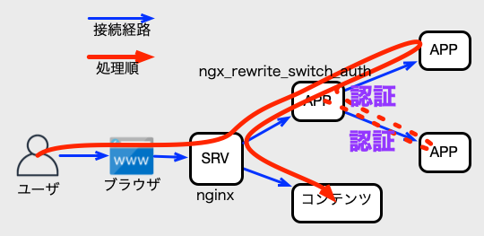
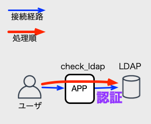
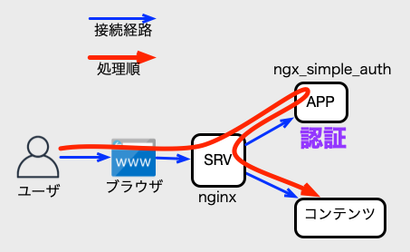

[auth request module]: http://nginx.org/en/docs/http/ngx_http_auth_request_module.html

English documents is [here](../docs/README.md).

# ngx\_auth\_mod

**ngx\_auth\_mod**は、
nginxの[auth request module]用に認証処理を提供するモジュール群です。  
ngx\_auth\_mod 公開の経緯は[こちら](https://eng-blog.iij.ad.jp/archives/13747)です。

## 使い方

使い方の説明については[はじめに](GettingStarted.md)を参照してください。

## モジュール仕様

### ngx\_ldap\_auth 

LDAPのbind処理での認証処理を流用して、認証するモジュールです。

以下の図のように**ngx\_ldap\_auth**を経由してLDAPを使った認証処理が行われます。

詳細は、[ngx\_ldap\_authプログラム仕様](ngx_ldap_auth.md)を参照してください。

### ngx\_ldap\_path\_auth 

LDAPのbind処理での認証処理を流用して認証し、かつ、ファイルパスによって認可をするモジュールです。

以下の図のように**ngx\_ldap\_path\_auth**を経由してLDAPを使った認証処理とグループ情報を使った認可処理が行われます。

詳細は、[ngx\_ldap\_path\_authプログラム仕様](ngx_ldap_path_auth.md)を参照してください。

### ngx\_header\_path\_auth 

HTTPヘッダーに渡されたユーザー名とファイルパスによって認可するモジュールです。

以下の図のように認可処理が行われます。

詳細は、[ngx\_header\_path\_authプログラム仕様](ngx_header_path_auth.md)を参照してください。

### ngx\_ldap\_path2ldap\_auth 

LDAPのbind処理での認証処理を流用して認証し、ファイルパスとLDAP情報で認可するモジュールです。

以下の図のように**ngx\_ldap\_path2ldap\_auth**を経由してLDAPを使った認証処理と認可処理が行われます。

詳細は、[ngx\_ldap\_path2ldap\_authプログラム仕様](ngx_ldap_path2ldap_auth.md)を参照してください。

### ngx\_rewrite\_auth

書き換えたリクエストでの別の認証を呼び出す認証モジュールです。
このモジュールはBasic認証から[auth request module]用認証への変換もできます。  
呼び出した認証が成功した時だけ、この認証は成功します。

**ngx\_rewrite\_auth**は、以下の図のように外部の認証モジュールを呼び出します。

このモジュールは柔軟性があり、以下のように、いろいろな用途に使えます。

- **別サイトの認証を流用**
    - 別サイトのBasic認証を[auth request module]用認証に変換できる。
- **認証をプロキシ**
    - 別サーバの[auth request module]用認証を利用できる。
- **メールアドレスでの認証**
    - メールアドレスをユーザ名に変換できる。(ex. `user@example.com` -> `user`)
- **ユーザ名での制限**
    - 正規表現で認証されるユーザ名をフィルターできる。
    - 正規表現で認証するユーザをフィルターできる。
- **キャッシュ設定のカスタマイズ**
    - キャッシュ用ヘッダーを上書きする

詳細は、[ngx\_rewrite\_authプログラム仕様](ngx_rewrite_auth.md)を参照してください。  

### ngx\_rewrite\_and\_auth

書き換えたリクエストで複数の認証を呼び出す認証モジュールです。
このモジュールはBasic認証から[auth request module]用認証への変換もできます。  
呼び出した認証が全て成功した時だけ、この認証は成功します。

**ngx\_rewrite\_and\_auth**は、以下の図のように外部の認証モジュール呼び出します。

このモジュールは柔軟性があり、以下のように、いろいろな用途に使えます。

- **認証と認可を分離**
    - 必要な権限に合わせて、システムを分離できる。
    - 例えば、**ngx\_ldap\_auth**と**ngx\_header\_auth**を連携できる。
- **認可部分の入れ替え**
    - 認証処理が流用できる。
- **複数の認証を結合**
    - 組み合わせる認証が選べる。

詳細は、[ngx\_rewrite\_and\_authプログラム仕様](ngx_rewrite_and_auth.md)を参照してください。  

### ngx\_rewrite\_switch\_auth

ユーザー名のパターンに基づいて選ばれた認証を呼び出す認証モジュールです。
このモジュールはBasic認証から[auth request module]用認証への変換もできます。  
ユーザー名のパターンで選んだ認証が成功した時だけ、この認証は成功します。

**ngx\_rewrite\_switch\_auth**は、以下の図のように外部の認証モジュール呼び出します。

このモジュールは柔軟性があり、以下のように、いろいろな用途に使えます。

- **複数組織の認証**
    - メールのドメインで認証処理を切替られる。
- **複数形式に対応した認証**
    - メールアドレスとユーザー名の両方で認証できる。

詳細は、[ngx\_rewrite\_switch\_authプログラム仕様](ngx_rewrite_switch_auth.md)を参照してください。  
### check\_ldap

**ngx\_ldap\_auth**または**ngx\_ldap\_path\_auth**の設定ファイルを使って、LDAPでの認証処理を動作確認するコマンドです。

詳細は、[check\_ldapプログラム仕様](check_ldap.md)を参照してください。

### ngx\_simple\_auth

設定ファイルに書かれたアカウント情報で認証する動作確認用モジュールです。

外部のデータを使わずに認証処理が行われるので、auth request module自体の設定確認に利用できます。

詳細は、[ngx\_simple\_authプログラム仕様](ngx_simple_auth.md)を参照してください。

