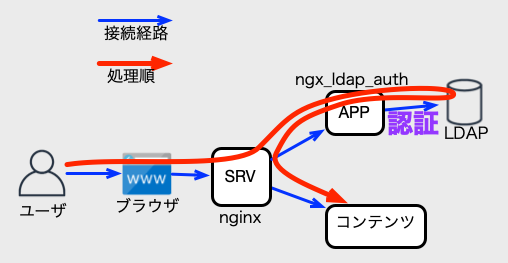

English documents is [here](../docs/README.md).

# ngx\_auth\_mod

**ngx\_auth\_mod**は、
nginxの[auth request module](http://nginx.org/en/docs/http/ngx_http_auth_request_module.html)用に認証処理を提供するモジュール群です。  
ngx\_auth\_mod 公開の経緯は[こちら](https://eng-blog.iij.ad.jp/archives/13747)です。

## 使い方

使い方の説明については[はじめに](GettingStarted.md)を参照してください。

## モジュール仕様

### ngx\_ldap\_auth 

LDAPのbind処理での認証処理を流用して、認証するモジュールです。

以下の図のように**ngx\_ldap\_auth**を経由してLDAPを使った認証処理が行われます。

使い方は、[ngx\_ldap\_authプログラム仕様](ngx_ldap_auth.md)を参照してください。

### ngx\_ldap\_path\_auth 

LDAPのbind処理での認証処理を流用して認証し、ファイルパスによって認可を行うモジュールです。

以下の図のように**ngx\_ldap\_path\_auth**を経由してLDAPを使った認証処理とグループ情報を使った認可処理が行われます。

使い方は、[ngx\_ldap\_path\_authプログラム仕様](ngx_ldap_path_auth.md)を参照してください。

### ngx\_header\_path\_auth 

HTTPヘッダーに渡されたユーザー名とファイルパスによって認可を行うモジュールです。

以下の図のように認可処理が行われます。

使い方は、[ngx\_header\_path\_authプログラム仕様](ngx_header_path_auth.md)を参照してください。

### ngx\_ldap\_path2ldap\_auth 

LDAPのbind処理での認証処理を流用して認証し、ファイルパスとLDAP情報で認可を行うモジュールです。

以下の図のように**ngx\_ldap\_path2ldap\_auth**を経由してLDAPを使った認証処理と認可処理が行われます。

使い方は、[ngx\_ldap\_path2ldap\_authプログラム仕様](ngx_ldap_path2ldap_auth.md)を参照してください。

### check\_ldap

**ngx\_ldap\_auth**または**ngx\_ldap\_path\_auth**の設定ファイルを使って、LDAPでの認証処理を動作確認するコマンドです。

使い方は、[check\_ldapプログラム仕様](check_ldap.md)を参照してください。

### ngx\_simple\_auth

設定ファイルに書かれたアカウント情報で認証するモジュールです。

外部のデータを使わずに認証処理が行われるので、auth request module自体の設定確認に利用できます。

使い方は、[ngx\_simple\_authプログラム仕様](ngx_simple_auth.md)を参照してください。

